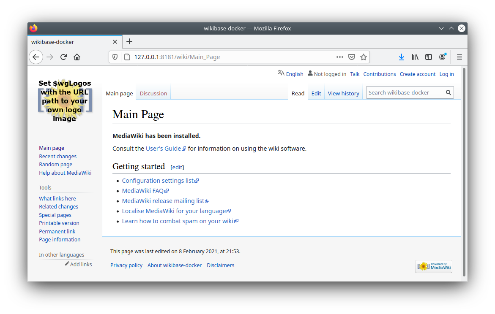
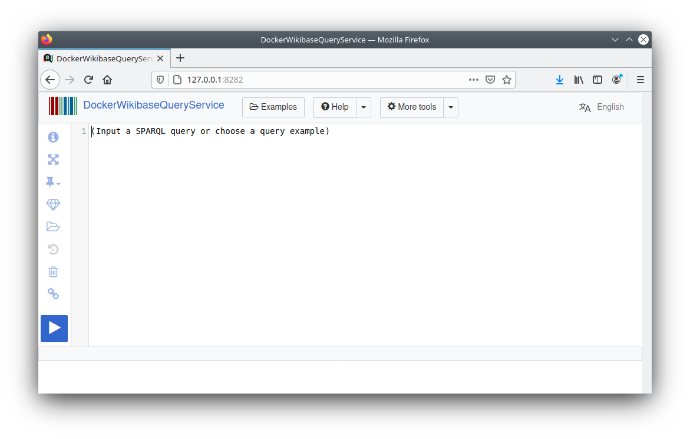

# Minimal Viable Wikibase (MVP)
This document describes the step involved in getting Wikibase running in a set of containers working in concertation. 

## Prerequisites
1. Docker
2. Docker-compose

Please refer to the installation instruction for both Docker and Docker-compose specific for your operationg system

## Pull and install docker images for Wikibase/OpenRefine using docker-compose
1. `docker-compose up --build --no-start novartis-openrefine`
2. `docker-compose up -d`
3. Review containers: `docker stats`

* Whether running in sudo is necessary, depends on local install instructions and settings

Upon completion of step 2 above, verify if Wikibase is installed by navigating a browser to
http://127.0.0.1:8181 for the core Wikibase stack and http://127.0.0.1:8282 for the Wikibase Query Service

If the following screens show in your browser, the installation process of wikibase succeeded

)

